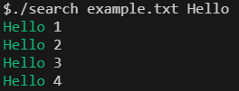
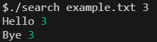
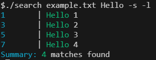

# 🔍 Search

A simple grep like tool for searching text in files

## Example








## Usage

```bash
search <pattern> <path> [args]
```

## Options

There are a few options you can use to customize the search

###  Case sensitive search

```bash
search <pattern> <path> -c
```

Or

```bash
search <pattern> <path> --case-sensitive
```

###  Show line number

```bash
search <pattern> <path> -l
```

Or

```bash
search <pattern> <path> --line-number
```

###  Show summary

```bash
search <pattern> <path> -s
```

Or

```bash
search <pattern> <path> --summary
```

###  Show help message

```bash
search <pattern> <path> -h
```

Or

```bash
search <pattern> <path> --help
```

###  Disable colored output

```bash
search <pattern> <path> -nc
```

Or

```bash
search <pattern> <path> --no-color
```

## 📝 License
This project is licensed under the GPL License - see the [LICENCE](LICENCE) file for details